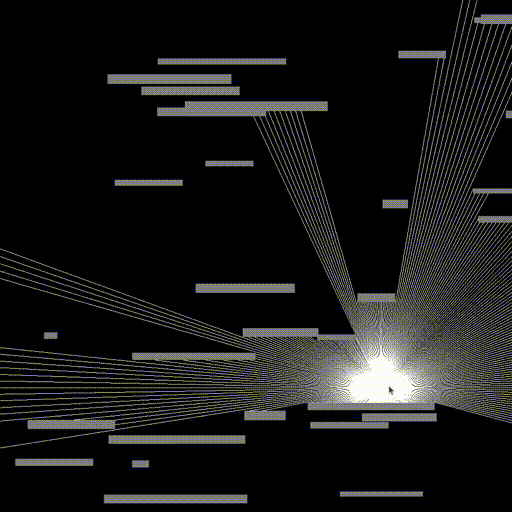

# Raycasted Point Collision



## Introduction

This guide explores a 2D raycasting system designed for detecting collisions between rays emanating from a point (typically the mouse cursor) and rectangular obstacles. The system comprises several key components that work together to create an efficient collision detection mechanism.

## Core Components

### 1. Ray Generation

The system generates rays from the mouse cursor position in a 360-degree circle. The number of rays is defined by `NUM_RAYS`, which is set to 360 in this implementation, effectively creating one ray per degree.

```cpp
struct ray {
    point_2d origin;
    vector_2d direction;
};

// In the main loop:
point_2d mouse = mouse_position();
std::vector<ray_hit> hits = cast_rays(obstacles, mouse, NUM_RAYS, MAX_DISTANCE);
```

### 2. Obstacle Generation

Rectangular obstacles are randomly generated at the start of the program, creating a dynamic environment for ray collision:

```cpp
std::vector<rectangle> generate_random_obstacles(int num_obstacles) {
    std::vector<rectangle> obstacles;
    for (int i = 0; i < num_obstacles; ++i) {
        double x = rnd(SCREEN_WIDTH);
        double y = rnd(SCREEN_HEIGHT);
        double width = rnd(10, 300);
        double height = rnd(10, 20);
        obstacles.push_back(rectangle_from(x, y, width, height));
    }
    return obstacles;
}
```

### 3. Ray-Rectangle Intersection Detection

The core of the collision detection is the `ray_rectangle_intersection` function, which implements the "slab" method for Ray-AABB (Axis-Aligned Bounding Box) intersection:

```cpp
bool ray_rectangle_intersection(const ray& r, const rectangle& rect, ray_hit& hit) {
    // Implementation details...
}
```

This function calculates the intersection point (if any) between a ray and a rectangle, storing the result in the `ray_hit` structure.

### 4. Ray Marching

The `march_ray` function simulates ray marching by checking for intersections with all obstacles and returning the closest hit  (this is not a real march, we don't iteratively extend a vector we just check for intersections and take the closest one):

```cpp
ray_hit march_ray(const ray& r, const std::vector<rectangle>& obstacles, double max_distance) {
    // Implementation details...
}
```

### 5. Visualization

The system visualizes the rays and obstacles using SplashKit's drawing functions:

```cpp
void draw_rays(const std::vector<ray_hit>& hits, const point_2d& origin, color c) {
    for (const auto& hit : hits) {
        draw_line(c, origin, hit.hit_point);
    }
}

void draw_obstacles(const std::vector<rectangle>& obstacles, color c) {
    for (const auto& obs : obstacles) {
        fill_rectangle(c, obs);
    }
}
```

## System Operation

1. Generate random obstacles
2. Cast rays from mouse position
3. Check ray-obstacle intersections
4. Store closest intersection points
5. Render rays and obstacles

This process creates a visual effect similar to 2D shadow casting, where the rays represent lines of sight from the mouse cursor, and the obstacles cast "shadows" by blocking the rays.

## Practical Applications

This raycasting system serves as a foundation for various game development and interactive application scenarios:

1. 2D lighting systems
2. Visibility graphs for pathfinding
3. Line-of-sight mechanics
4. Collision avoidance
5. Interactive visualizations
6. Procedural level generation
7. Simple physics simulations

## Potential Enhancements

1. True ray marching for complex scenes
2. Dynamic, moving obstacles
3. Spatial partitioning for performance
4. Soft shadows and advanced lighting
5. 3D extension
